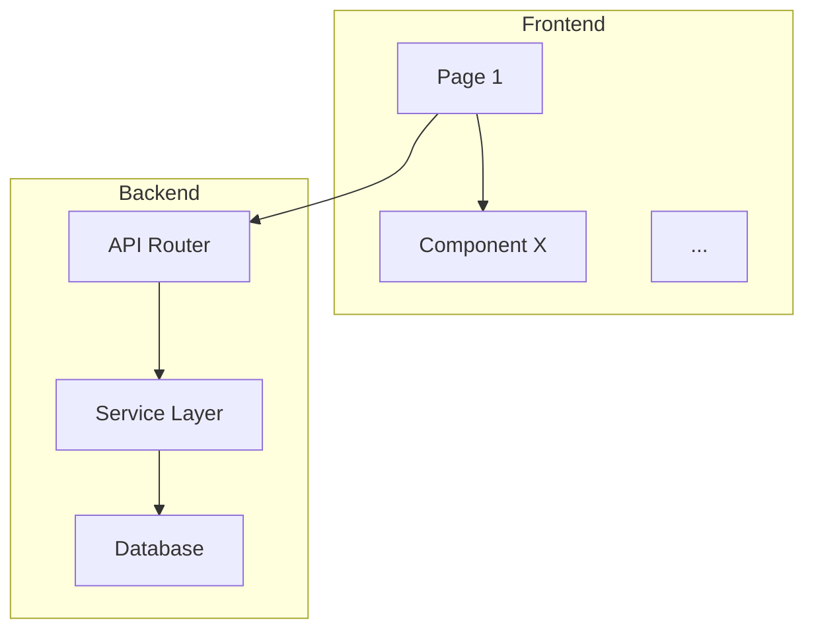

# Prompt Alignment & Build Planner

## Overview

This skill converts brainstorm output into execution-ready build plans. It operates in two modes:

```
Mode 1 (Review):    Existing prompts → Validate → Corrections → Execution Guide
Mode 2 (Reorganize): Feature designs → Extract → Resolve conflicts → Layer-order prompts → Architecture docs → Execution Guide
```

**Reorganize mode** is the primary workflow for new projects. Brainstorming produces feature-oriented designs (what the search does, what the dashboard does). This skill reorganizes them into build-order prompts (database first, then services, then API, then frontend) and generates architecture documentation that persists as context for the entire project lifecycle.

**Review mode** is for existing prompt sets that need validation before execution.

## When to Use

- **Reorganize**: After brainstorming all features for a new project. You have design docs in `docs/plans/` and want build-order implementation prompts.
- **Review**: After prompts already exist in `docs/implementation-prompts/` and you want to validate them before handing off.

## Mode Detection

If `--mode` is not specified:
- If `docs/implementation-prompts/{project}/MANIFEST.md` exists → **Review mode**
- If design docs exist in `docs/plans/` but no MANIFEST → **Reorganize mode**
- If unclear, ask the user

---

# MODE 1: REVIEW

For validating and generating execution guides for existing prompt sets. Use when prompts are already written and ordered.

Input: `docs/implementation-prompts/{project}/*.md`
Output: Corrections report + `README.md` execution guide

## Review Phase 1: Inventory & Parse

Read `MANIFEST.md`, design doc, `CLAUDE.md`, and every prompt file. For each prompt extract: order, title, dependencies, files to create/modify, skills, scope, acceptance criteria, out of scope items.

Build and present to user:
- **Dependency graph**: visual execution order
- **File touchpoint matrix**: which prompts touch which files
- **Data contracts**: JSON schemas, DB tables, API shapes that flow between prompts

## Review Phase 2: Deep Analysis (Agent Team)

Launch 3 agents in parallel:

**Agent 1 — Codebase Auditor**: Verify every file reference in every prompt (exists? line numbers correct? descriptions accurate?). Map current app state (DB schema, API routes, frontend components, migration history, dependencies). Return verification failures + key files list.

**Agent 2 — Cross-Prompt Validator**: Check dependency correctness, file conflicts, data contract consistency. Find missing dependencies, circular deps, parallelizable prompts. Return corrections + conflict list + data contract mismatches.

**Agent 3 — Pattern & Gotcha Finder**: Identify codebase patterns (DAO, routing, error handling, frontend, config). Find token-wasting gotchas (idempotency guards, file size warnings, path quirks, missing DAOs, naming inconsistencies). Return pattern guide + gotcha list with file:line references.

Consolidate all 3 agent results.

## Review Phase 3: Right-Sizing

Evaluate each prompt:
- **Too large** (split): 5+ files, 3+ creates + 2+ modifies, multiple objectives, >150K tokens
- **Too small** (merge): 1-2 minor file changes, <30K tokens, same deps as adjacent, not a distinct concern
- **Scope creep**: Requirements outside design doc, items from another prompt's "Out of Scope"
- **Missing prompts**: Design doc gaps, implicit steps not covered

## Review Phase 4: Corrections Report

Per-prompt corrections with status, specific fixes, missing dependencies, file reference fixes, scope assessment. **Present to user and wait for approval** before generating execution guide.

## Review Phase 5: Generate Execution Guide

Write `docs/implementation-prompts/{project}/README.md` following the established format:
- What You're Building (summary + prompt table)
- Before You Start (3-5 files to read)
- Per-prompt sections: What It Does, Files to Read, Corrections, Verify After Completing
- Data contracts, gotchas, architecture rules, testing, deploy steps
- Post-Implementation section with archiving instructions:
  ```
  ## Post-Implementation
  1. Archive completed prompts: `mv docs/implementation-prompts/{project}/[0-9]*.md docs/implementation-prompts/{project}/archive/`
  2. Update MANIFEST.md statuses to Done
  3. Delete prompt items from `TODO.md`
  4. Add one-liner to `WORK-COMPLETED.md`
  ```

---

# MODE 2: REORGANIZE

For converting feature-oriented brainstorm output into layer-ordered build prompts with architecture documentation. This is the primary workflow for new projects.

Input: Feature design docs in `docs/plans/`
Output: Layer-ordered prompts in `docs/implementation/`, architecture docs in `docs/architecture/`, execution guide

## Reorganize Phase 1: Ingest Feature Designs

**Goal**: Build a complete picture of everything the application needs.

**Actions**:
1. Read `CLAUDE.md` for project conventions and solicitation context
2. Read `docs/solicitation/SOURCES.md` if it exists (original RFP/RFI materials)
3. Read ALL design docs in `docs/plans/` — these are the brainstorm outputs
4. For each design doc, extract:
   - Feature name and purpose
   - Database tables and columns needed
   - API endpoints (method, path, request/response shape)
   - Services / business logic
   - Frontend components and pages
   - External integrations (APIs, AWS services, third-party tools)
   - Environment variables / configuration
   - Dependencies (Python packages, npm packages)

5. Build a **master inventory** — a single consolidated list of ALL:
   - Database tables (with columns, types, relationships, indexes)
   - API endpoints (with methods, paths, request/response shapes)
   - Services (with responsibilities and dependencies)
   - Frontend components (with props, state, interactions)
   - External integrations
   - Environment variables

Present the master inventory to the user as a summary table per category.

## Reorganize Phase 2: Cross-Feature Extraction (Agent Team)

**Goal**: Deep-dive into each layer to find conflicts and overlaps.

Launch 3 agents in parallel:

### Agent 1: Data Layer Analyst

Read all design docs. Extract and analyze:
- **Every database table** across all features — columns, types, constraints, foreign keys
- **Naming conflicts**: Do two features define tables with the same name but different schemas?
- **Missing relationships**: Feature A's table references Feature B's table but Feature B doesn't define it
- **Shared tables**: Multiple features need the same table — merge or separate?
- **Seed data requirements**: What data must exist at first boot?
- **Migration ordering**: Which tables must exist before others (foreign key dependencies)?
- Return: Consolidated schema, conflicts list, recommended table ordering

### Agent 2: Service & API Layer Analyst

Read all design docs. Extract and analyze:
- **Every API endpoint** across all features — method, path, request body, response shape, auth
- **Path conflicts**: Do two features define endpoints at the same path?
- **Shared services**: Multiple features need the same business logic — where does it live?
- **Data flow**: How does data move from endpoint → service → database → response?
- **Error handling patterns**: What should the standard error response look like?
- **Authentication/authorization**: What endpoints need auth? What pattern?
- Return: Consolidated API spec, service inventory, conflicts list

### Agent 3: Frontend & Integration Analyst

Read all design docs. Extract and analyze:
- **Every UI component** across all features — pages, modals, forms, tables, charts
- **Shared components**: Multiple features need similar UI elements — extract common components?
- **State management**: What state is shared vs local? What data fetching pattern?
- **Routing**: What pages/routes does the app need?
- **Integration wiring**: How do frontend components connect to API endpoints?
- **Configuration**: All environment variables, feature flags, build config
- Return: Component inventory, shared component candidates, route map, integration matrix

After all 3 agents complete, consolidate findings.

## Reorganize Phase 3: Discrepancy Resolution (Interactive)

**Goal**: Present every conflict and ambiguity to the user for decisions. Do NOT assume.

This is a back-and-forth discussion. For each discrepancy found by the agents:

1. **Present the conflict clearly**:
   - What two (or more) features disagree on
   - The specific details of each side
   - Your recommendation with reasoning

2. **Ask the user to decide** using AskUserQuestion:
   - Option A: Feature X's approach
   - Option B: Feature Y's approach
   - Option C: Your recommended compromise
   - Other: User provides custom resolution

3. **Log the decision** inline and to the structured log:
   ```
   DECISION: architecture - {summary}
   CONFLICT: {feature A} vs {feature B}
   RESOLUTION: {what was chosen}
   REASONING: {why}
   ```

   Then persist it:
   ```bash
   python scripts/log_decision.py \
     --category architecture \
     --summary "{summary}" \
     --reasoning "{why}" \
     --proposed "{feature A approach}" \
     --changed "{resolution}" \
     --alternatives "{feature A approach},{feature B approach}" \
     --confidence {high|medium|low}
   ```

**Categories of discrepancies to resolve**:
- Table schema conflicts (same table, different columns)
- API path conflicts (same route, different handlers)
- Shared vs duplicated logic (extract service or keep separate?)
- Frontend framework/pattern choices (if features assumed different approaches)
- Authentication approach (if not already decided)
- Missing pieces (features that reference things no other feature provides)
- Scope questions (is this in scope for the demo or a future enhancement?)

After ALL discrepancies are resolved, present a clean summary of decisions made.

## Reorganize Phase 4: Layer Decomposition & Prompt Writing

**Goal**: Decompose the resolved inventory into layer-ordered implementation prompts.

### Build Layers

Decompose into these standard layers (adjust based on project):

| Layer | Prompt | What It Covers |
|-------|--------|---------------|
| **1. Foundation** | `01-project-setup.md` | Project scaffolding, dependency installation, docker-compose, .env.example, directory structure |
| **2. Database** | `02-database-schema.md` | ALL tables, ALL migrations, seed data, DAO/repository layer |
| **3. Core Services** | `03-core-services.md` | Business logic, external API integrations, background tasks, shared utilities |
| **4. API Routes** | `04-api-routes.md` | ALL endpoints, request validation, response formatting, error handling, auth middleware |
| **5. Frontend** | `05-frontend.md` | ALL pages, components, routing, state management, API integration, styling |
| **6. Integration** | `06-integration-wiring.md` | Wire frontend ↔ API, end-to-end data flow, health check, error states, loading states |
| **7. Polish** | `07-testing-deploy.md` | Docker build verification, seed data validation, deploy config, smoke tests |

**Right-sizing within layers**: If a layer is too large for a single prompt (>150K estimated tokens, >5 files with major changes), split it. Common splits:
- Database: schema + migrations in one prompt, seed data + DAOs in another
- Frontend: pages/layout in one prompt, complex components/interactions in another
- API: CRUD endpoints in one prompt, complex business endpoints in another

### Writing Each Prompt

For each layer prompt, write a complete implementation prompt following `docs/implementation-prompts/SCHEMA.md`:

```markdown
# Implementation Prompt: {Layer Name}

## Metadata
- **Order**: {01-07}
- **Dependencies**: {prior layers}
- **Skills**: {relevant skills for this layer}
- **Scope**: {Small | Medium | Large}
- **Estimated Tokens**: ~{X}K input, ~{Y}K output
- **AWS Cost Impact**: {None | description}

## Context
{What exists at this point — reference prior layer outputs}
{Reference the architecture docs for the full picture}

## Objective
{One sentence: what this prompt produces}

## Requirements
{Exhaustive list — everything from ALL features that belongs in this layer}
{Group by feature if helpful, but the prompt covers the ENTIRE layer}

## Acceptance Criteria
{Testable conditions — specific endpoints to curl, pages to load, queries to run}

## Technical Notes
{Framework patterns, conventions, gotchas from the design docs}
{Reference architecture docs: "See docs/architecture/data-model.md for full schema"}

## Files to Create/Modify
| Action | Path | Description |
|--------|------|-------------|

## Out of Scope
{What belongs to other layers — be explicit}
```

Write all prompts to `docs/implementation/` (NOT `docs/implementation-prompts/` — this is the build-order output, separate from any brainstorm-stage rough prompts).

Write `docs/implementation/MANIFEST.md` with the standard manifest format.

## Reorganize Phase 4b: Parallel Build Analysis

**Goal**: Determine if the prompts can be split into parallel build agents to cut wall-clock time and reduce per-session context.

### When to Parallelize

| Condition | Result |
|-----------|--------|
| 5+ prompts with a clear backend/frontend split | **Parallel** |
| Architecture docs define the full API contract (api-spec.md) | **Parallel** |
| <5 prompts total | **Sequential** |
| Single-directory project (no backend/frontend separation) | **Sequential** |
| Tightly coupled layers where frontend needs live backend to build | **Sequential** |

### Analysis Steps

1. **Build the dependency DAG** from the MANIFEST.md Dependencies column.

2. **Identify file ownership per prompt**: Which directories does each prompt create or modify? Look at the "Files to Create/Modify" table in each prompt.

3. **Find the natural split**:
   - **Setup prompts**: Depend on nothing, create scaffolding for both sides (typically prompt 01)
   - **Backend chain**: Prompts whose files are exclusively in `backend/` (or equivalent server directory)
   - **Frontend chain**: Prompts whose files are exclusively in `frontend/` (or equivalent client directory)
   - **Integration prompts**: Touch both `backend/` and `frontend/` (typically the last prompt)

4. **Validate the split**:
   - Backend chain must not need frontend code to compile or run
   - Frontend chain must not need a running backend (api-spec.md suffices for types and contracts)
   - No two parallel prompts touch the same file
   - Shared config files (docker-compose.yml, .gitignore) are created by setup, not modified by parallel agents

5. **If valid split found**:
   - Write `docs/implementation/execution-plan.json`:
     ```json
     {
       "strategy": "parallel",
       "setup_prompts": ["01"],
       "agents": [
         {
           "name": "backend",
           "prompts": ["02", "03", "04"],
           "owns": ["backend/"],
           "docs": ["architecture.md", "data-model.md", "api-spec.md"]
         },
         {
           "name": "frontend",
           "prompts": ["05", "06"],
           "owns": ["frontend/"],
           "docs": ["architecture.md", "api-spec.md"]
         }
       ],
       "integration_prompts": ["07"]
     }
     ```
   - Update MANIFEST.md to show parallel groups (see format below)

6. **If no valid split**: Either omit `execution-plan.json` or write it with `"strategy": "sequential"`. The build script falls back to single-session mode.

### Updated MANIFEST.md Format (Parallel)

When parallel execution is detected, structure MANIFEST.md like this:

```markdown
## Execution Strategy: Parallel

### Phase 1: Setup (Sequential)
| # | Title | Layer | Scope | Status | Dependencies |
|---|-------|-------|-------|--------|-------------|
| 01 | Project Setup & Docker | Foundation | Medium | Pending | None |

### Phase 2: Parallel Build
**Agent A (backend/)**:
| # | Title | Layer | Scope | Status | Dependencies |
|---|-------|-------|-------|--------|-------------|
| 02 | Database Schema & Seed Data | Data | Large | Pending | 01 |
| 03 | Backend Services | Services | Large | Pending | 02 |
| 04 | API Routes | API | Large | Pending | 03 |

**Agent B (frontend/)**:
| # | Title | Layer | Scope | Status | Dependencies |
|---|-------|-------|-------|--------|-------------|
| 05 | Frontend Foundation | Frontend | Large | Pending | 01 |
| 06 | Frontend Pages | Frontend | Large | Pending | 05 |

### Phase 3: Integration (Sequential)
| # | Title | Layer | Scope | Status | Dependencies |
|---|-------|-------|-------|--------|-------------|
| 07 | Integration & Deploy | Integration | Large | Pending | 04, 06 |
```

## Reorganize Phase 5: Architecture Documentation

**Goal**: Generate persistent reference documents that serve as context for the ENTIRE project lifecycle — not just initial build, but every future change.

### Document 1: `docs/architecture/architecture.md`

```markdown
# {Project Name} — Architecture

## System Overview
{2-3 paragraph description of what the system does and how}

## Tech Stack
| Layer | Technology | Why |
|-------|-----------|-----|
| Frontend | {framework} | {reason} |
| Backend | {framework} | {reason} |
| Database | {type} | {reason} |
| Hosting | {platform} | {reason} |

## Component Diagram


## API Overview
| Method | Path | Description | Auth |
|--------|------|-------------|------|
{Every endpoint in the system}

## Data Flow
{How data moves through the system for key user flows}

## Key Decisions
{Architectural decisions made during alignment, with reasoning}

## Configuration
| Variable | Purpose | Default | Required |
|----------|---------|---------|----------|
{Every env var}
```

### Document 2: `docs/architecture/data-model.md`

```markdown
# {Project Name} — Data Model

## Entity Relationship Diagram
```mermaid
erDiagram
    TABLE_A ||--o{ TABLE_B : "has many"
    ...
```

## Tables

### {table_name}
| Column | Type | Constraints | Description |
|--------|------|-------------|-------------|

{Repeat for every table}

## Migrations
| # | Name | What It Does |
|---|------|-------------|

## Seed Data
{What data ships with the app and why}
```

### Document 3: `docs/architecture/api-spec.md`

```markdown
# {Project Name} — API Specification

## Base URL
`{base_url}`

## Authentication
{Auth pattern, if any}

## Endpoints

### {Resource Name}

#### {METHOD} {path}
{Description}

**Request:**
```json
{example request body}
```

**Response:**
```json
{example response}
```

**Error Responses:**
| Status | Meaning |
|--------|---------|

{Repeat for every endpoint}
```

### Why These Documents Matter

These docs are NOT just for the initial build. They serve as **persistent context** for any future Claude Code session working on this project. When a user asks to "add a new feature" or "fix a bug" months later, the session reads these docs and immediately understands the system architecture, data model, and API surface without re-exploring the codebase from scratch.

The CLAUDE.md in the campaign repo should reference these docs in "Before making changes, read:" section.

## Reorganize Phase 6: Execution Guide

**Goal**: Write the README.md that a fresh execution session (or `launch-build.ps1`) uses to build the application.

The format depends on whether Phase 4b produced a parallel execution plan.

### Sequential README (no execution-plan.json or strategy=sequential)

Write `docs/implementation/README.md`:

```markdown
# {Project Name} — Build Guide

> **Purpose**: Everything a fresh Claude Code session needs to build this application from scratch.
> Read this INSTEAD of exploring the codebase.

## What You're Building
{2-3 sentence summary}

| # | Prompt | Layer | Key Output |
|---|--------|-------|------------|
| 01 | Project Setup | Foundation | Scaffolding, docker-compose, dependencies |
| 02 | Database Schema | Data | Tables, migrations, seed data, DAOs |
| ... | ... | ... | ... |

**Build strictly in order: 01 → 02 → ... → 07.**

## Architecture Reference

Before starting, read these docs for the full picture:
1. `docs/architecture/architecture.md` — system design + component diagram
2. `docs/architecture/data-model.md` — all tables + ER diagram
3. `docs/architecture/api-spec.md` — all endpoints

These are your ground truth. If a prompt contradicts an architecture doc, the architecture doc wins.

## Before You Start

1. Read `CLAUDE.md` — project context and conventions
2. Read the architecture docs above
3. Read `docs/implementation/MANIFEST.md` — prompt overview

---

{Per-prompt sections with: What It Does, Key Files Created, Verify After Completing}

---

## After All Prompts

### Verify the Build
```bash
docker compose up --build
# App should be accessible at http://localhost:{port}
# Health check: curl http://localhost:{port}/health
```

### Archive Completed Prompts
After all prompts execute successfully, move them to `archive/`:
```bash
mkdir -p docs/implementation/archive
mv docs/implementation/0*.md docs/implementation/archive/
# MANIFEST.md and README.md stay — only numbered prompts move
```
Update MANIFEST.md statuses to Done.

### Update Campaign Status
```bash
python scripts/campaign.py advance --to testing
```

## Context Budget
- Architecture docs: ~{X}K tokens
- Per-prompt reads: ~{Y}K tokens average
- Total estimated build: ~{Z}K tokens across all prompts
```

### Parallel README (when execution-plan.json has strategy=parallel)

Write `docs/implementation/README.md` with the parallel execution graph instead of a linear sequence:

```markdown
# {Project Name} — Build Guide

> **Purpose**: This project uses parallel build agents for faster builds and smaller context windows.
> `launch-build.ps1` reads `execution-plan.json` and orchestrates everything automatically.

## What You're Building
{2-3 sentence summary}

## Execution Graph

```
Setup (01)  ─── synchronous, creates scaffolding for both sides
     │
     ├── Agent A (backend)  ─── prompts 02, 03, 04
     │     Owns: backend/
     │     Reads: architecture.md, data-model.md, api-spec.md
     │
     └── Agent B (frontend)  ─── prompts 05, 06
           Owns: frontend/
           Reads: architecture.md, api-spec.md
                       │
         Both signal via check-parallel-done.ps1
                       │
Integration (07)  ─── wires frontend to backend, fixes mismatches
```

## Architecture Reference

Before starting, read these docs for the full picture:
1. `docs/architecture/architecture.md` — system design + component diagram
2. `docs/architecture/data-model.md` — all tables + ER diagram
3. `docs/architecture/api-spec.md` — all endpoints

These are your ground truth. If a prompt contradicts an architecture doc, the architecture doc wins.

## Agent-Specific Reading Lists

**Agent A (backend)**: CLAUDE.md, architecture.md, data-model.md, api-spec.md
**Agent B (frontend)**: CLAUDE.md, architecture.md, api-spec.md (no data-model.md needed)
**Integration**: CLAUDE.md, all three architecture docs

## How Parallel Completion Works

Each agent's final action is `powershell -File scripts/check-parallel-done.ps1 -Agent <name>`.
This writes a `.agent-<name>-complete` marker file. When both markers exist, integration launches
automatically via `launch-integrate.ps1`. An atomic file lock (`.integration-lock`) prevents
duplicate integration sessions if both agents finish simultaneously.

---

{Per-prompt sections grouped by agent, with: What It Does, Key Files Created, Verify After Completing}

---

## After All Prompts

### Verify the Build
```bash
docker compose up --build
# App should be accessible at http://localhost:{port}
# Health check: curl http://localhost:{port}/health
```

### Archive Completed Prompts
```bash
mkdir -p docs/implementation/archive
mv docs/implementation/0*.md docs/implementation/archive/
```

### Update Campaign Status
```bash
python scripts/campaign.py advance --to testing
```

## Context Budget
- Setup: ~{X}K tokens
- Agent A ({N} prompts): ~{Y}K tokens
- Agent B ({M} prompts): ~{Z}K tokens
- Integration: ~{W}K tokens
- Total: ~{T}K tokens (vs ~{S}K sequential = {R}x reduction)
```

Present the complete execution guide to the user for final review.

## Reorganize Phase 7: Launch Build Session

**Goal**: Hand off to `launch-build.ps1`, which reads the execution plan and orchestrates everything.

After the execution guide is reviewed (or immediately, if running in auto-start mode with no user present):

### Step 1: Write Build Marker

Write `.build-ready` to the repo root with session metadata:

```json
{
  "created_at": "ISO timestamp",
  "prompt_count": 7,
  "strategy": "parallel or sequential",
  "architecture_docs": ["docs/architecture/architecture.md", "docs/architecture/data-model.md", "docs/architecture/api-spec.md"],
  "build_guide": "docs/implementation/README.md",
  "execution_plan": "docs/implementation/execution-plan.json",
  "source_phase": "scoping"
}
```

### Step 2: Advance Campaign Lane

```bash
python scripts/campaign.py advance --force
```

This moves the campaign from `scoping` to `development`.

### Step 3: Launch Build via Script

Run `launch-build.ps1`. The script reads `docs/implementation/execution-plan.json` and decides:
- **Parallel**: Runs setup synchronously, then spawns Agent A + Agent B in separate windows
- **Sequential**: Spawns a single build session (original behavior)

```bash
powershell -File scripts/launch-build.ps1
```

Do NOT construct the claude launch command manually. The script handles everything: prompt construction, scaffolding verification, agent spawning, and session cleanup.

### Step 4: Report Completion

Tell the user:

> Scoping complete. All architecture docs and build prompts written to disk.

If parallel mode:
> Build launching with parallel agents (backend + frontend). Setup runs first, then two agent windows open simultaneously. Integration launches automatically when both finish.

If sequential mode:
> A fresh build session has launched in a new terminal window.

> This session's work is done. You can close this window.

If the Bash launch fails (e.g., not on Windows, or PowerShell not available), fall back to:

> Scoping complete. To start building, open a new Claude Code session in this directory and run:
> `claude --dangerously-skip-permissions "Read docs/implementation/README.md and execute all build prompts in order."`

---

# SHARED GUIDELINES

## Agent Team Sizing

- **2-3 prompts**: Use 2 agents (combine Cross-Prompt Validator and Pattern Finder)
- **4+ prompts or reorganize mode**: Use 3 agents

## Quality Checks

Before finalizing any output:
- [ ] Every file reference points to a real file (or will be created by a prior prompt)
- [ ] Every verification block has runnable commands
- [ ] Data contracts are consistent across all prompts
- [ ] Architecture docs match the implementation prompts
- [ ] The "Before You Start" section is minimal (3-5 files)

## Error Recovery

If an agent fails or returns incomplete results:
1. Note what's missing
2. Re-run the specific agent with a narrower focus
3. Do NOT skip the analysis

## Campaign Repo File Structure

After reorganize mode completes, the campaign repo should have:

```
campaign-repo/
├── CLAUDE.md                         # Workflow + solicitation context
├── .campaign.json                    # API bridge
├── docs/
│   ├── solicitation/SOURCES.md       # Original RFP materials
│   ├── plans/                        # Feature design docs (brainstorm output)
│   │   ├── feature-a-design.md
│   │   └── feature-b-design.md
│   ├── architecture/                 # System-level docs (alignment output)
│   │   ├── architecture.md
│   │   ├── data-model.md
│   │   └── api-spec.md
│   └── implementation/               # Build-order prompts (alignment output)
│       ├── MANIFEST.md
│       ├── README.md
│       ├── 01-project-setup.md
│       ├── 02-database-schema.md
│       ├── 03-core-services.md
│       ├── 04-api-routes.md
│       ├── 05-frontend.md
│       ├── 06-integration-wiring.md
│       ├── 07-testing-deploy.md
│       └── archive/
├── src/                              # Built by execution
├── scripts/campaign.py
└── .claude/skills/
```

## Integration with Workflow

This skill fits into the campaign development flow:

```
Dashboard: Start Campaign → Create Repo
  ↓
Scoping Phase (same Claude Code session):
  1. /environment-constraints — research target environment
  2. /brainstorming — design features (repeat per feature)
     Output: docs/plans/{feature}-design.md
  ↓
Alignment Phase (same session):
  3. /align {project} --reorganize — resolve conflicts, write build prompts
     Output: docs/architecture/*, docs/implementation/*, execution-plan.json
     Phase 4b determines parallel vs sequential strategy
  ↓
Development Phase (launch-build.ps1 orchestrates):
  If parallel (5+ prompts, clear backend/frontend split):
    Setup: prompt 01 runs synchronously
    Agent A: backend prompts in fresh session
    Agent B: frontend prompts in fresh session (simultaneous)
    Integration: final prompt wires everything together
  If sequential:
    Single session: 01 → 02 → ... → 07
  ↓
Testing Phase:
  5. docker compose up, smoke tests, manual QA
  ↓
Documentation Phase:
  6. /response-package — generate proposal docs
  7. /package — package for handoff
```
